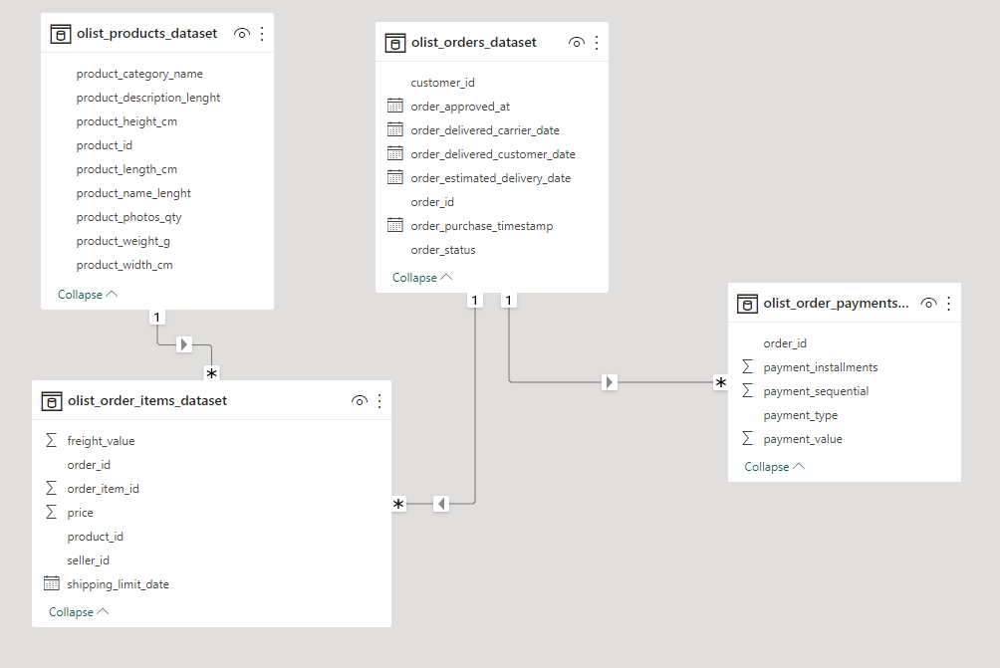

# Brazilian E-Commerce project
This is a demo project written in pyspark to prepare the required dataset for the modeler
[requirements]
1. We want to forecast for each item, what are the sales going to be next week.
   Expected output is repository that has the following:
   1. Code to load relevant tables for the task (minimum tables needed), 
      and prepare efficient ETL that builds a dataset on which Data Scientist can continue the work (use pandas) 
      The output should be in parquet, well partitioned by product
   2. The format of output is a single table that can be used for modelling (no need to extract features).
2. python script to run code, that you can pass arguments to
3. A couple of simple pytest tests, and run them in github actions at every PR.
4. Configuration files in yml

[project structure]
1. etl/__main__.py: Main script to run the PySpark job.
2. requirements.txt: List of Python dependencies.
3. README.md: This README file.
4. config/settings.yaml: Folder containing configuration files.
5. etl/: Folder containing the source code for the PySpark job.
6. tests/: Folder containing test files.

[usage]
config file: 
  please refer to setting.yaml in config directory which consists of two sections "DEV" and "PROD",you can 
  get the input columns, result columns and filters for each table in the config file
  result columns are: product_id,order_id ,product_category_name ,order_purchase_timestamp ,payment_value

how to run this program:
 1. the program entry point is etl.__main__.main, you can refer to the setup.py, you can run the program by using 
    spark submit or build a python wheel and run it on databricks with a parameter --envt provided,if not provided 
    "DEV" will be used
 2. the main function will read a parameter(--envt) from command line to determine the environment "DEV" or "PROD", 
    so the program will fetch corresponding section of data from yaml file
 3. after create an instance of Transform class, it will later run the pipeline method to construct the dataclass 
    YmlConf and perform the ETL process

if you want to know more about what each function/method do, you can refer to the docstring under def statements

[possible improvements]:
1. function filter the data by country is not provided yet in the program, but can be implemented without big change, 
   you can just add filters to the table that has a country column in the yaml file, 
   or you can get the "countries" key value pair in the yaml file to update the logic of extract method in 
   transform class
2. transform logic can be written in sql statements and put it in the yaml file or database, or if there is a 
   common pattern, we can split the transform logic and make the transform method more flexible, so in the future, 
   we will only need change the yaml file without touch the code to get what we need
3. in order to make the application more reliable, validate function/method to be added
4. possible join optimization can be added in the transform operations depend on table size
5. some logger information to be added in some key functions/method

[data model]

